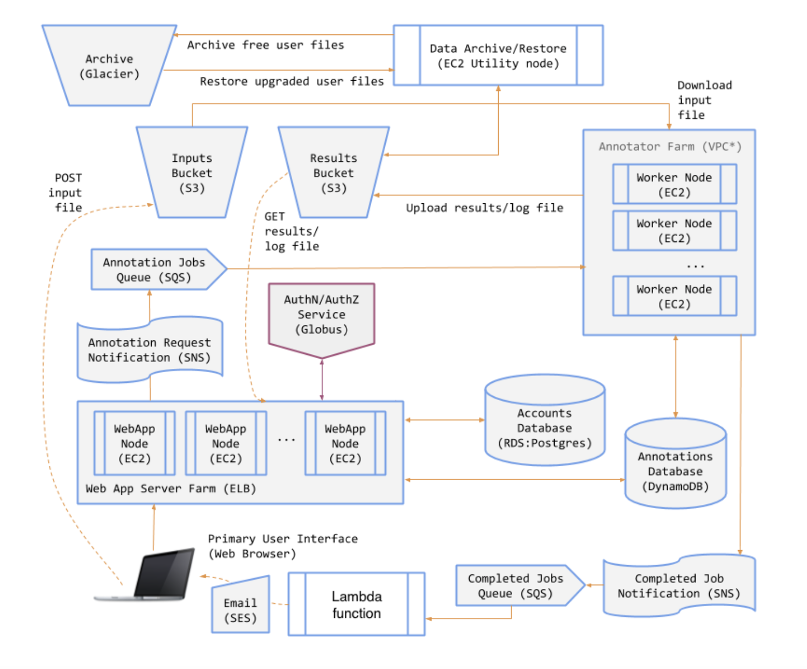

# Genomics Annotation Service

**Note:** This implementation does not include auto-scaling for the annotator or web application instances.

## Project Overview
This project is a fully functional **Genomics Annotation Service** that utilizes the **AnnTools** package to analyze and process genetic data submitted by users. Genomics annotation refers to the process of identifying and mapping features within DNA sequences, such as genes, mutations, and functional elements. This service allows users to submit files for annotation, view, and download results through a web interface.

The system supports two user tiers:
- **Free users**: Can submit annotation jobs, but their results are archived to **AWS Glacier** after a short period.
- **Premium users**: Have permanent access to their results and can retrieve archived files upon upgrading.

The service is built on **AWS cloud infrastructure**, leveraging **S3, SNS, SQS, Lambda, Step Functions, and Glacier** to create a scalable, cost-effective, and efficient annotation pipeline.

## Workflow

This section outlines the step-by-step process of how the genomics annotation system works, from job submission to result processing and archival.

### Job Submission
- Users submit genomics annotation jobs via a **web interface**.
- The input file is uploaded to an **S3 bucket** (`gas-inputs`).

### Job Processing
- Job details, including user ID and role, are sent to an **SNS topic** (`joshcox_job_requests`).
- An **SQS queue** subscribed to this topic holds the message until it is fetched by the annotator instance.
- The annotator instance retrieves the message, downloads the input file from **S3**, and processes it using **AnnTools**.
- Results and log files are generated and uploaded to the **S3 bucket** (`gas-results`).

### Archival for Free Users
- If the user is **free-tier**, a message is sent to an **SNS topic** (`joshcox_job_results`).
- An **SQS queue** subscribed to this topic captures the message.
- A **Step Function** triggers an archival process after a **3-minute delay**, sending the task to an **archival script** running on a utility instance.
- The script verifies archival status in **DynamoDB** (`joshcox_annotations` table) before archiving.
- If the file is archived, it is stored in **AWS Glacier** and removed from **S3**.
- The **DynamoDB table** is updated with the Glacier **archive ID**.

### Upgrading to Premium & Restoration
- When a user upgrades to **premium**, the restoration process is triggered via a web interface (`/subscribe`).
- A message with the **archive details** is sent to an **SQS queue** (`joshcox_thaw_requests`).
- A script (`thaw_script.py`) running on a **utility instance** fetches the message and initiates a **Glacier archive retrieval job**.
- Once the archive is ready, **Glacier sends an SNS notification** (`joshcox_thaw_restore`).
- This triggers an **AWS Lambda function**, which:
  - Retrieves the archive from **Glacier**.
  - Stores it back in the **S3 bucket** (`gas-results`).
  - Updates **DynamoDB** to mark the restoration as complete.
  - Deletes the archive from **Glacier** and removes the processed message from **SQS**.

### Web Interface Update
- The `annotation.html` page dynamically updates based on the user’s role.
- **Free users** see a prompt to upgrade once their results are archived.
- **Premium users** retain access to their results without archival.

## System Design Rationale
This architecture leverages AWS services to ensure:
- **Asynchronous Processing**: SNS, SQS, and Lambda decouple job submission and processing, improving system responsiveness.
- **Cost Efficiency**: Serverless execution with **AWS Lambda** and automated archival reduces storage costs.
- **Workflow Automation**: Event-driven triggers streamline job submission, processing, and archival tasks.
- **Reliability & Scalability**: Built-in retry mechanisms in SQS and Lambda enhance system robustness.

This project demonstrates an efficient, **cloud-based genomics annotation service**, leveraging AWS for optimal performance and cost-effectiveness.

**Note:** This implementation does not include auto-scaling for the annotator or web application instances.
